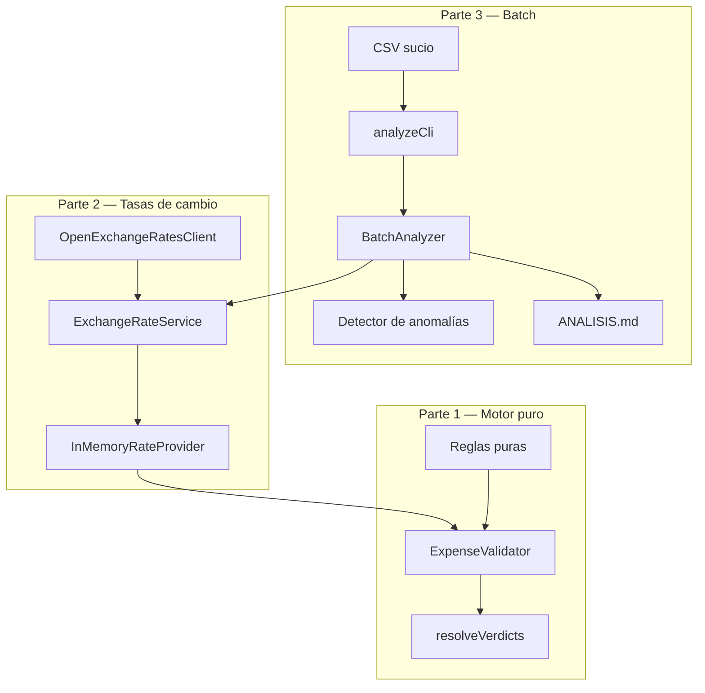

# Xpendit Rules Engine

Motor de reglas de gastos para el desafío Xpendit. Valida gastos contra una política configurable y devuelve uno de tres estados: `APROBADO`, `PENDIENTE` o `RECHAZADO`.

El proyecto está dividido en **tres partes** que se apoyan una sobre otra:

| Parte | Qué hace | Carpeta principal |
|-------|----------|-------------------|
| **1** | Lógica pura de validación (sin red) | `src/rules/`, `src/services/expenseValidator.ts` |
| **2** | Integración con Open Exchange Rates | `src/services/openExchangeRatesClient.ts` |
| **3** | Análisis por lotes del CSV + reporte | `src/batch/` |

---

## Requisitos

- Node.js 20+
- npm

## Instalación

```bash
npm install
cp .env.example .env   # opcional: solo necesario para tasas live
```

```env
OPEN_EXCHANGE_RATES_APP_ID=your_app_id_here
```

## Comandos

```bash
npm test              # 127 pruebas (unitarias + e2e)
npm run test:e2e      # solo pruebas e2e
npm run test:coverage   # cobertura (~97%)
npm run typecheck
npm run build
npm run demo:rates      # demo Parte 2 con API real
npm run analyze         # Parte 3: CSV → ANALISIS.md
```

---

## Decisiones de arquitectura

Esta sección explica **por qué** el código está organizado así. La idea central es simple:

> **Separar lo que decide (reglas puras) de lo que obtiene datos (API, CSV, reloj) y de lo que orquesta lotes (batch).**

### Vista general



---

### 1. Tres capas, una responsabilidad cada una

| Capa | Responsabilidad | No debe hacer |
|------|-----------------|---------------|
| **Dominio + reglas** | Decidir si un gasto es APROBADO / PENDIENTE / RECHAZADO | Llamadas HTTP, leer archivos, parsear CSV |
| **Servicios** | Reloj, tasas de cambio, cliente API, validador | Conocer el formato del CSV |
| **Batch** | Cargar CSV, detectar anomalías, optimizar API, generar reporte | Cambiar la lógica de las reglas |

**Beneficio:** puedes probar las reglas con datos falsos (mock) sin red ni archivos. La Parte 2 y 3 se conectan *inyectando* dependencias, no modificando el motor.

---

### 2. Reglas como funciones puras

Cada regla (`src/rules/`) es una función que recibe un `RuleContext` y devuelve:

- un veredicto parcial `{ status, alerta? }`, o
- `null` si la regla no aplica (solo la regla de centro de costo hace esto).

```typescript
// Cada regla es independiente y testeable sola
evaluateAntiguedadRule(context)      // siempre aplica
evaluateLimiteCategoriaRule(context) // aplica si hay límite o categoría desconocida
evaluateCentroCostoRule(context)     // null si no hay prohibición
```

**Por qué:** agregar una regla nueva = agregar un archivo + registrarlo en el validador. No hay que tocar las reglas existentes.

---

### 3. Resolución de estado: una sola función, prioridad clara

Todas las reglas corren siempre. Luego `resolveVerdicts()` combina los resultados:

```
RECHAZADO  >  PENDIENTE  >  APROBADO
```

- El **estado final** lo gana la regla más severa.
- Las **alertas** se acumulan de *todas* las reglas que dispararon (no solo la ganadora).
- Si ninguna regla aplica → `PENDIENTE` sin alertas.

**Por qué:** coincide exactamente con la especificación del PDF y evita duplicar lógica de prioridad en cada regla.

---

### 4. Inyección de dependencias: reloj y tasas

El validador **no** llama a `new Date()` ni a la API directamente. Recibe:

| Dependencia | Interfaz | Para qué |
|-------------|----------|----------|
| Reloj | `Clock` | Calcular antigüedad del gasto |
| Tasas | `RateProvider` | Convertir montos a moneda base |

```typescript
new ExpenseValidator({
  clock: new FixedClock(new Date("2026-06-19")),  // fecha fija en tests
  rateProvider: new InMemoryRateProvider({ CLP: 900 }), // mock en Parte 1
});
```

**Por qué:**
- Tests **determinísticos** (misma fecha → mismos resultados).
- Parte 2 cambia *solo* el proveedor de tasas, no el motor.
- Parte 1 sigue siendo lógica pura aunque Parte 2 use red.

---

### 5. Tasas de cambio: prefetch + snapshot síncrono

La API de Open Exchange Rates es **asíncrona**, pero las reglas son **síncronas**. La solución:

```
1. BatchRateResolver obtiene tasas por fecha (async, una vez por fecha única)
2. Construye un InMemoryRateProvider (sync) por cada fecha
3. El validador usa ese snapshot — sin await dentro de las reglas
```

**Optimización N+1 (Parte 3):**

| Enfoque naive | Enfoque implementado |
|---------------|---------------------|
| 50 filas → 50 llamadas API | 50 filas → **25 fechas únicas** → **25 llamadas** |
| Una llamada por gasto | Una llamada por fecha, reutilizada en todas las filas de ese día |

**Modo offline (`--mock`):** usa tasas locales de `data/fallback-rates.json` sin llamar a la API. Sin `--mock`, se requiere `OPEN_EXCHANGE_RATES_APP_ID` y cualquier fallo de la API detiene el análisis.

---

### 6. Validación con Zod en cada frontera

Los datos "sucios" entran por muchos lados. Cada uno se valida con Zod antes de usarse:

| Entrada | Schema | Dónde |
|---------|--------|-------|
| Gasto, empleado, política | `gastoSchema`, `empleadoSchema`, `politicaSchema` | Validador |
| Fila CSV | `csvRowSchema` | `csvLoader` |
| Respuesta API | `openExchangeRatesRateSetSchema` | Cliente OXR |
| Variables de entorno | `envSchema` | `config/` |
| Resultado final | `validationResultSchema` | Salida del validador |

Errores → `ValidationError` con mensajes claros. Las filas CSV malformadas se **recogen** (no tumban todo el lote).

**Por qué:** el CSV migrado del sistema antiguo puede tener basura. Validar temprano evita bugs silenciosos en conversiones o comparaciones.

---

### 7. Montos con `decimal.js`, no `number`

JavaScript `0.1 + 0.2 !== 0.3`. Para dinero y tasas de cambio eso importa.

- `Money = Decimal` (vía `decimal.js`)
- Conversiones redondeadas a **4 decimales** (`ROUND_HALF_UP`), como Open Exchange Rates
- Duplicados detectados con `moneyKey()` — clave canónica del monto

Los días de antigüedad siguen siendo `number` (enteros): no son dinero.

---

### 8. Política inmutable

La política (`Politica`) se congela en runtime:

```
parsePolitica(input) → validar con Zod → clonar → deepFreeze → objeto inmutable
```

- `defaultPolitica` se congela al cargar el módulo
- Mutar la política en runtime lanza `TypeError`
- También se puede cargar desde JSON con `--policy`

**Por qué:** en un lote de 50 gastos, todos deben evaluarse contra la **misma** política. Un cambio accidental a mitad del batch corrompería los resultados.

---

### 9. Categorías desconocidas (`NO_POLICY`)

Si un gasto tiene categoría sin límite configurado (ej. `software`, `lodging`):

- Estado configurable vía `categoria_desconocida` (default: `PENDIENTE`)
- Alerta con código `NO_POLICY`

**Por qué:** sin esto, un gasto en categoría desconocida podía salir `APROBADO` solo porque la regla de antigüedad lo aprobaba. Eso es engañoso.

---

### 10. Anomalías separadas de las reglas de política

Duplicados exactos y montos negativos se detectan en `anomalyDetector.ts`, **fuera** del motor de reglas.

| Tipo | Criterio | ¿Cambia el status? |
|------|----------|-------------------|
| `DUPLICADO_EXACTO` | mismo monto + moneda + fecha | **No** — se reporta en `anomalies[]` |
| `MONTO_NEGATIVO` | monto < 0 | **No** — se reporta en `anomalies[]` |

**Por qué:** las reglas del PDF son de *política* (antigüedad, límites, centro de costo). Las anomalías son *calidad de datos* — un duplicado puede ser APROBADO por política pero sospechoso por datos. Separar ambos conceptos mantiene cada capa simple.

---

### 11. CLI testeable

`analyzeCli.ts` separa la lógica del CLI de `analyze.ts` (entry point):

- **Parseo de argumentos** → `parseAnalyzeArgs()`
- **Orquestación** → `runAnalyze()` con dependencias inyectables (filesystem, env)
- **Entry point** → `analyze.ts` (solo llama a `mainAnalyze`)

**Por qué:** 27 tests unitarios del CLI + e2e con spawn de proceso, sin escribir archivos reales en disco del proyecto.

---

### 12. Estrategia de pruebas

| Tipo | Carpeta | Qué cubre |
|------|---------|-----------|
| **Unitarias** | `tests/unit/` | Cada regla, validador, cliente API, CSV, CLI — sin red |
| **E2E** | `tests/e2e/` | Pipeline completo sobre `gastos_historicos.csv` |

El test e2e principal (`gastosHistoricos.test.ts`) es un **golden file**:

- Los 50 gastos se validan con tasas mock y fecha fija `2026-06-19`
- Se verifica el desglose exacto: 9 APROBADO / 17 PENDIENTE / 24 RECHAZADO
- Cada `gasto_id` tiene su status y alertas esperados
- Los 7 grupos de duplicados se verifican uno a uno

**Por qué:** si alguien cambia una regla sin querer, el golden test lo detecta inmediatamente.

---

## Reglas implementadas

| Regla | Condición | Resultado |
|-------|-----------|-----------|
| Antigüedad | 0–30 días | APROBADO |
| Antigüedad | 31–60 días | PENDIENTE |
| Antigüedad | > 60 días | RECHAZADO |
| Límite por categoría | monto ≤ aprobado_hasta (USD) | APROBADO |
| Límite por categoría | aprobado_hasta < monto ≤ pendiente_hasta | PENDIENTE |
| Límite por categoría | monto > pendiente_hasta | RECHAZADO |
| Categoría desconocida | sin límite configurado | `categoria_desconocida` (default PENDIENTE) + alerta `NO_POLICY` |
| Centro de costo | categoría prohibida para el C.C. | RECHAZADO |

**Resolución:** RECHAZADO > PENDIENTE > APROBADO. Sin reglas aplicables → PENDIENTE.

---

## Uso

### Parte 1 — Validador con tasas mock

```typescript
import {
  ExpenseValidator,
  FixedClock,
  InMemoryRateProvider,
  toMoney,
} from "./dist/index.js";

const validator = new ExpenseValidator({
  clock: new FixedClock(new Date("2026-06-19T00:00:00.000Z")),
  rateProvider: new InMemoryRateProvider({ CLP: 900, MXN: 20, EUR: 0.92 }),
});

const result = validator.validate(
  { id: "g_125", monto: toMoney(50), moneda: "USD", fecha: "2026-06-04", categoria: "food" },
  { id: "e_002", nombre: "Bruno", apellido: "Soto", cost_center: "sales_team" },
  politica,
);
// { gasto_id: "g_125", status: "APROBADO", alertas: [] }
```

### Parte 2 — Tasas reales

```bash
npm run demo:rates
```

O programáticamente con `ExchangeRateService` + `OpenExchangeRatesClient` (ver `examples/validateWithLiveRates.ts`).

### Parte 3 — Analizador de lotes

```bash
# Default: gastos_historicos.csv → ANALISIS.md
npm run analyze

# Offline, fecha fija, sin escribir archivo
npm run analyze -- --mock -d 2026-06-19 --no-write

# Política personalizada + salida JSON
npm run analyze -- --policy mi-politica.json --json --mock
```

| Flag | Descripción |
|------|-------------|
| `-i, --input <path>` | Ruta al CSV |
| `-o, --output <path>` | Ruta del reporte markdown |
| `-d, --reference-date <date>` | Fecha de referencia ISO (`YYYY-MM-DD`) |
| `--mock, --offline` | Modo offline: tasas de `data/fallback-rates.json` (requerido sin API key) |
| `--policy <path>` | Política JSON personalizada |
| `--fallback-rates <path>` | Tasas de respaldo alternativas |
| `--no-write` | No escribe `ANALISIS.md` |
| `--json` | Imprime reporte JSON en stdout |
| `--json-output <path>` | Escribe reporte JSON en archivo |

---

## Estructura del proyecto

```
src/
  domain/          # Tipos, schemas Zod, money (decimal.js), códigos de alerta
  rules/           # Reglas puras (antigüedad, categoría, centro de costo)
  services/        # Validador, cliente API, cache de tasas, reloj
  validation/      # Errores, inmutabilidad, primitivos (fechas, monedas)
  api/             # Schemas de respuesta Open Exchange Rates
  config/          # dotenv + validación de API key
  batch/           # CSV, anomalías, analizador, reporting, CLI
data/
  fallback-rates.json
examples/
  validateWithLiveRates.ts
tests/
  unit/            # Pruebas por módulo (sin red)
  e2e/             # Golden tests sobre gastos_historicos.csv
  helpers/         # Mock rate resolver compartido
  fixtures/        # CSV y datos de prueba
ANALISIS.md        # Reporte generado por Parte 3
```

## Dependencias

| Paquete | Por qué |
|---------|---------|
| `zod` | Validación de schemas en fronteras (CSV, API, dominio) |
| `decimal.js` | Precisión monetaria sin errores de float |
| `csv-parse` | Parseo robusto del CSV |
| `dotenv` | Carga de `.env` para API key |

Solo 4 dependencias de runtime — cada una con un propósito claro.
